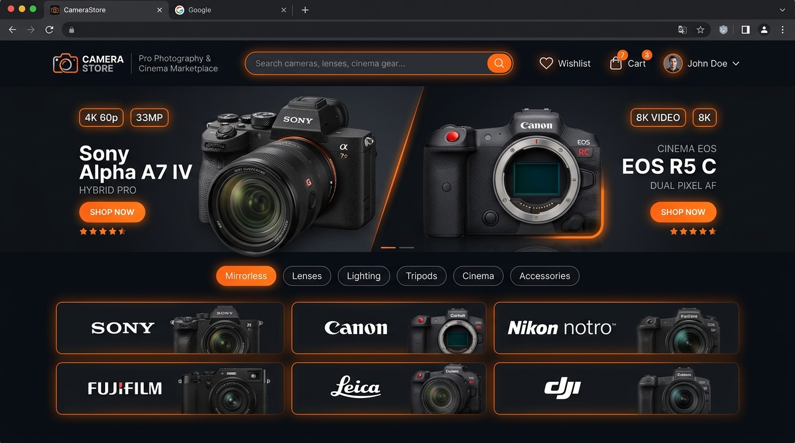
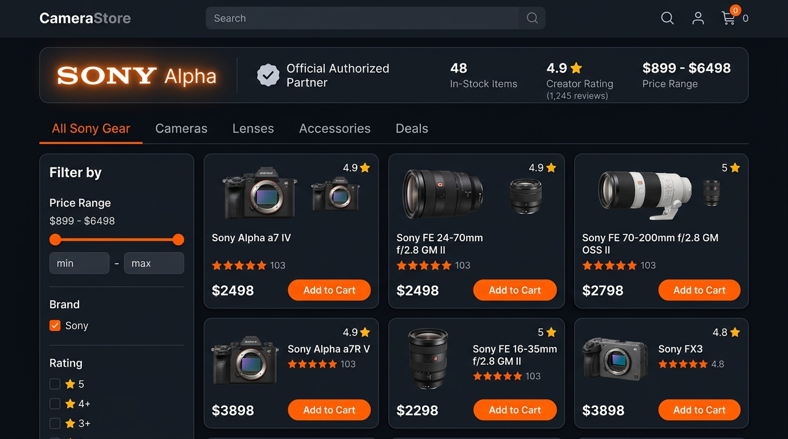
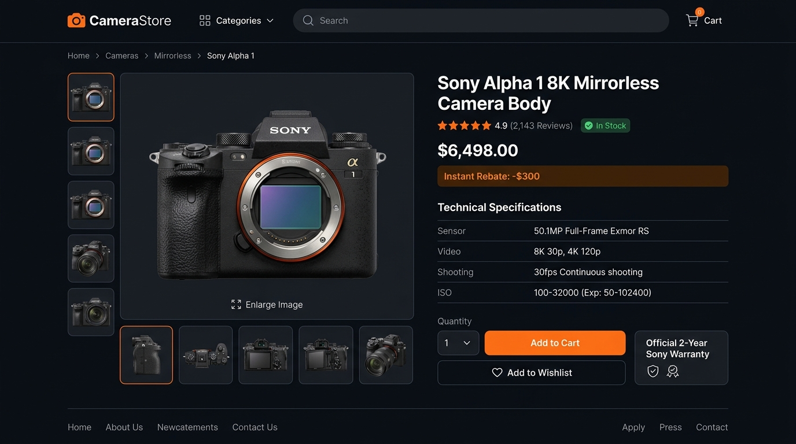
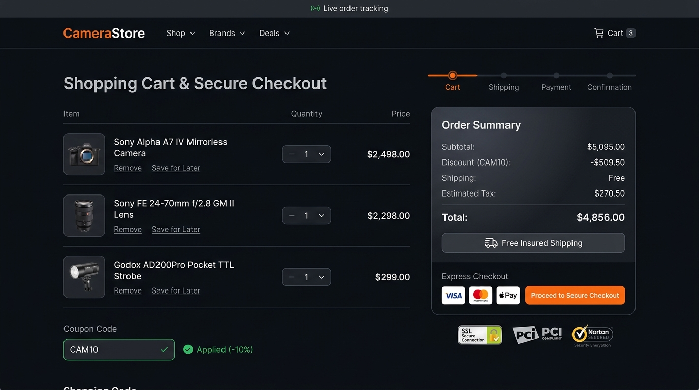
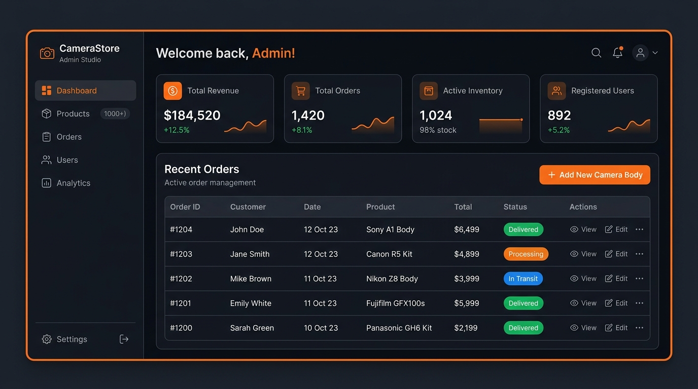

# 📷 CameraStore – Pro Photography & Cinema Marketplace

<div align="center">

[](https://reactjs.org/)
[](https://redux-toolkit.js.org/)
[](https://vitejs.dev/)
[](https://reactrouter.com/)
[](https://lucide.dev/)
[](https://opensource.org/licenses/MIT)

**A full-featured, cinema-grade e-commerce marketplace built for professional photographers, filmmakers, and digital creators.**

[Live Demo](#-getting-started) • [Explore Features](#-key-features) • [Brand Portals](#-brand-storefronts) • [Admin Studio](#-admin-studio-control-panel) • [Tech Stack](#-technology-stack)

</div>

---

## 🌟 Hero Showcase



---

## 📸 Key Features

### 🛒 1. Marketplace & Multi-Category Catalog
- **6 Core Photography Categories**: *Cameras*, *Lenses*, *Lighting*, *Tripods & Support*, *Camera Bags*, and *Studio Accessories*.
- **1,000+ Photography Gear Items**: High-resolution photography assets, sensor specifications, mount types, aperture ranges, and verified pricing.
- **Dynamic Multi-Parameter Filters**: Filter by brand, subcategory pill, interactive price slider ($50 – $10,000+), customer star rating (4.0★ to 4.8★+), and instant sorting (*Featured*, *Price: Low to High*, *Price: High to Low*, *Rating*, *Discount*).
- **Instant Search & Real-Time Auto-Suggest**: Live dropdown search preview across camera models, optics, series, and sensor formats.

---

### 🏷️ 2. Official Brand Storefronts & Directory
Clicking on any world-leading photography brand (*Sony*, *Canon*, *Nikon*, *Fujifilm*, *Leica*, *DJI*, *Sigma*, *Godox*, *Peak Design*, *Manfrotto*, *SanDisk*, *Aputure*, *Nanlite*) opens a tailored, dedicated brand portal.



- **Official Authorized Partner Verification**: Authentic distributor badges and brand philosophies.
- **Dynamic In-Stock Metrics**: Live gear count, creator rating, and active price range.
- **Category Filter Tabs**: Dynamically filtered tabs showing available product types for each brand.
- **Brand Hop Switcher**: Quick-switch carousel to explore other major camera manufacturers.

---

### 🔍 3. Cinema-Grade Product Details & Gallery
Comprehensive specification breakdown designed for filmmakers and gear enthusiasts.



- **Multi-Angle Interactive Gallery**: High-fidelity zoom, multi-angle thumbnails, and lightbox previews.
- **Technical Specs Matrix**: Sensor type, video resolutions (8K/4K 120p), continuous shooting speeds, ISO sensitivity, and mount compatibility.
- **Instant Rebate Badges**: Live promotional pricing, deal badges, and coupon discounts.
- **Warranty & Fulfillment Guarantee**: 2-year official manufacturer warranty and 30-day returns.

---

### 💳 4. Shopping Cart, Wishlist & Express Checkout
A seamless, frictionless purchasing experience with promotional coupon integration.



- **Cart Management**: Quantity increment/decrement, line-item removal, save-for-later, and persistent Redux store.
- **Coupon & Rebate Engine**: Active promo codes (`CAM10` for 10% off, `PROPHOTO` for $150 rebate, `FESTIVE20` for 20% bonus).
- **Multi-Step Checkout Pipeline**: Shipping address, contact validation, card payment simulator, and instant order generation.
- **Live Order Tracking**: Instant order success screen, trackable order ID, and customer purchase history.

---

### ⚡ 5. Admin Studio Control Panel
Complete back-office suite to manage photography catalog inventory, orders, and registered creators.



- **Executive KPI Cards**: Real-time revenue telemetry, total order volume, inventory stock health, and user metrics.
- **Inventory Management**: Create new camera bodies/lenses, update pricing, toggle stock, and delete items.
- **Order Pipeline Manager**: Update fulfillment status (*Processing*, *In Transit*, *Shipped*, *Delivered*).
- **User Directory**: View registered creators, customer tiers, and account permissions.

---

## 🛠️ Technology Stack

| Layer | Technology |
| :--- | :--- |
| **Frontend Framework** | React 19 + Vite 8 |
| **State Management** | Redux Toolkit (`@reduxjs/toolkit` + `react-redux`) |
| **Routing** | React Router v7 (`react-router-dom`) |
| **Icons & UI Assets** | Lucide React (`lucide-react`) + FontAwesome 6 (`react-icons`) |
| **Styling** | Vanilla Modular CSS with CSS Custom Properties & Glassmorphism |
| **Architecture** | Component-Driven, Atomic Redux Slices, Custom Context Providers |

---

## 📂 Project Architecture

```text
camerastore/
├── public/
├── docs/
│   └── images/                     # Showcase screenshots & mockups
│       ├── hero-showcase.jpg
│       ├── brand-storefront.jpg
│       ├── product-details.jpg
│       ├── cart-checkout.jpg
│       └── admin-dashboard.jpg
├── src/
│   ├── admin/                      # Admin Studio Suite
│   │   ├── AdminDashboard.jsx      # Analytics & KPI overview
│   │   ├── AdminProducts.jsx       # Inventory management table
│   │   ├── AddProduct.jsx          # New product creation wizard
│   │   ├── EditProduct.jsx         # Product editor
│   │   ├── AdminOrders.jsx         # Order fulfillment & status pipeline
│   │   ├── AdminUsers.jsx          # User management directory
│   │   └── AdminLogin.jsx          # Admin authentication
│   ├── components/                 # Reusable UI Components
│   │   ├── Navbar.jsx              # Search, live preview, cart/wishlist counters
│   │   ├── Footer.jsx              # Brand directory, newsletter, quick links
│   │   ├── ProductCard.jsx         # Interactive card with add-to-cart/wishlist
│   │   ├── CategoryCard.jsx        # Category gateway card
│   │   ├── SearchBar.jsx           # Real-time search filter
│   │   ├── Sidebar.jsx             # Sidebar filter panel
│   │   ├── Banner.jsx              # Promotional banners
│   │   └── ScrollToTop.jsx         # Smooth scroll transition on route change
│   ├── context/                    # Context Providers
│   │   ├── AuthContext.jsx         # Authentication & user session state
│   │   └── CartContext.jsx         # Cart & order calculations
│   ├── data/                       # Mock Data & Catalog
│   │   ├── cameraProducts.js       # Top brands, categories & coupons
│   │   └── catalogGenerator.js     # 1,000+ item generator for photography catalog
│   ├── pages/                      # Page Views & Routes
│   │   ├── Home.jsx                # Landing page with hero & brand showcase
│   │   ├── BrandPage.jsx           # Dedicated brand storefront & directory
│   │   ├── Cameras.jsx             # Digital cameras & cinema bodies catalog
│   │   ├── Lenses.jsx              # Camera lenses & optics catalog
│   │   ├── Lighting.jsx            # Studio strobe & continuous lighting catalog
│   │   ├── Tripods.jsx             # Carbon fiber tripods & gimbals catalog
│   │   ├── Bags.jsx                # Weatherproof backpacks & cases catalog
│   │   ├── Accessories.jsx         # Filters, SD cards & batteries catalog
│   │   ├── ProductDetails.jsx      # Rich gallery, specs & reviews
│   │   ├── Wishlist.jsx            # Saved gear wishlist
│   │   ├── Cart.jsx                # Shopping cart & coupon engine
│   │   ├── Checkout.jsx            # Multi-step payment checkout
│   │   ├── OrderSuccess.jsx        # Order confirmation & receipt
│   │   ├── Orders.jsx              # Customer purchase history & tracking
│   │   ├── Profile.jsx             # User profile & saved addresses
│   │   ├── Login.jsx               # User login
│   │   ├── Register.jsx            # User registration
│   │   └── ForgotPassword.jsx      # Password reset flow
│   ├── redux/                      # Redux Toolkit Slices & Store
│   │   ├── slices/
│   │   │   ├── productSlice.js
│   │   │   ├── cartSlice.js
│   │   │   ├── wishlistSlice.js
│   │   │   ├── orderSlice.js
│   │   │   └── authSlice.js
│   │   └── store.js
│   ├── routes/
│   │   └── AppRoutes.jsx           # Centralized routing configuration
│   ├── styles/                     # Modular CSS stylesheets
│   ├── App.jsx                     # Root application wrapper
│   └── main.jsx                    # Vite entry point
├── package.json
└── README.md
```

---

## 🚀 Getting Started

### Prerequisites
- **Node.js**: v18.0.0 or higher
- **npm** or **yarn** / **pnpm**

### Installation & Run

1. **Clone the repository**:
   ```bash
   git clone https://github.com/harish-0987/CameraStore-Photography-Camera-Marketplace.git
   cd CameraStore-Photography-Camera-Marketplace
   ```

2. **Install dependencies**:
   ```bash
   npm install
   ```

3. **Start the local development server**:
   ```bash
   npm run dev
   ```
   Open [http://localhost:5173](http://localhost:5173) in your browser.

4. **Build for production**:
   ```bash
   npm run build
   ```

---

## 📄 License

This project is licensed under the [MIT License](LICENSE).

---

<div align="center">
  <sub>Engineered with precision for creators, photographers, and filmmakers worldwide.</sub>
</div>
